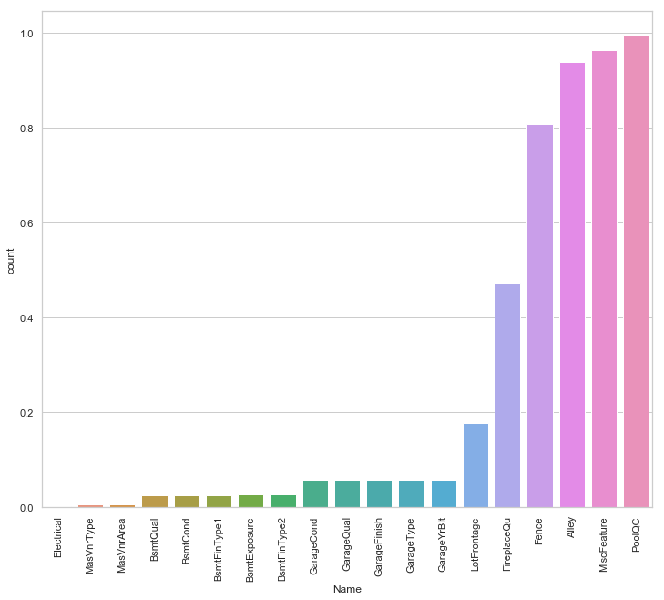
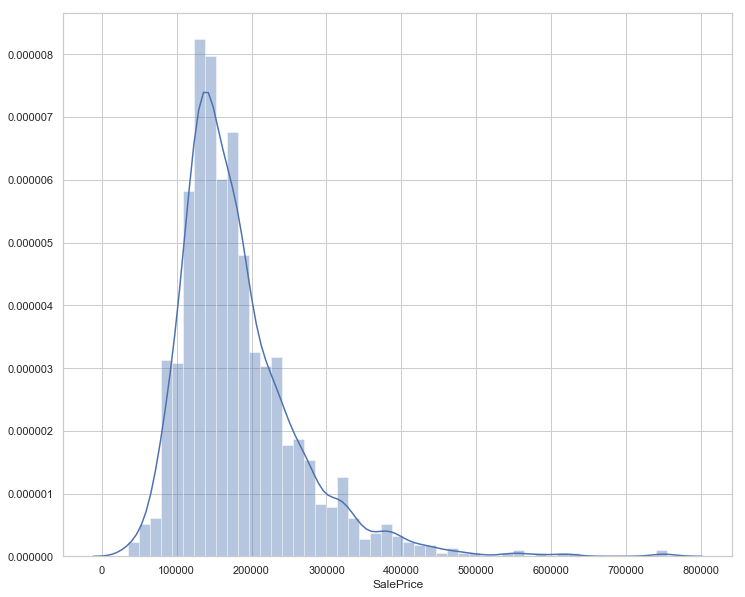
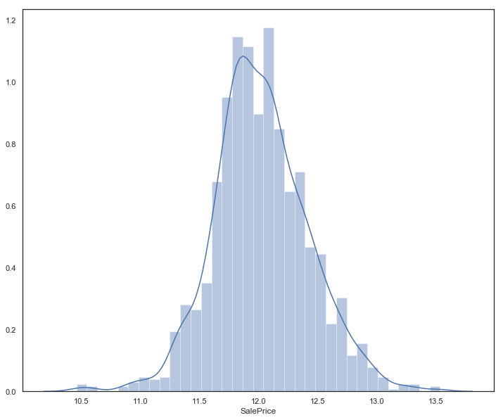
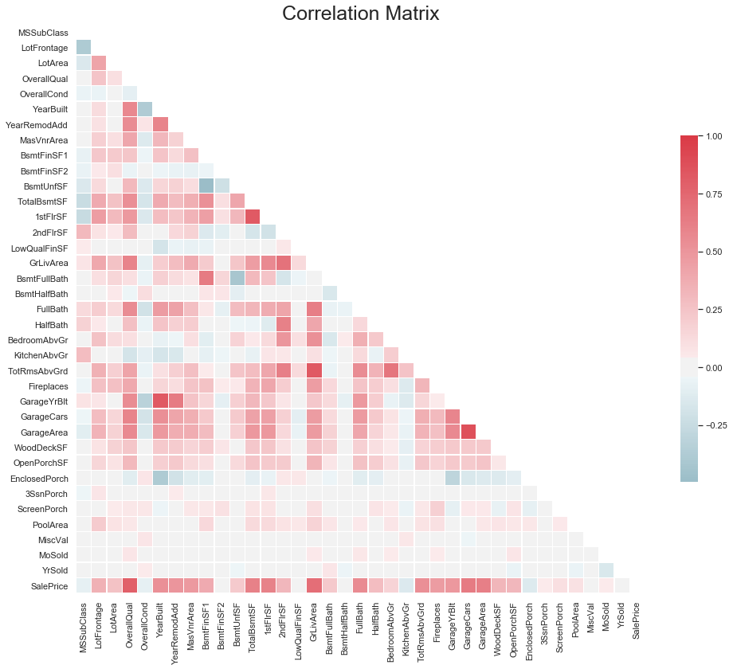
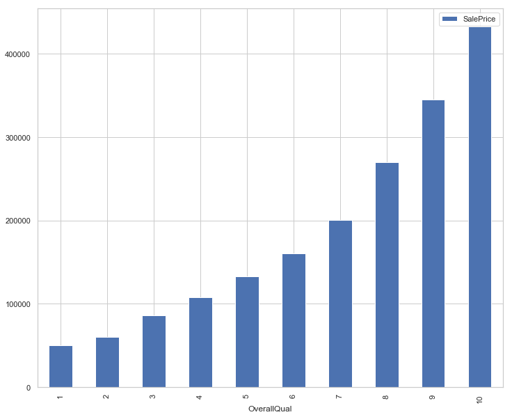
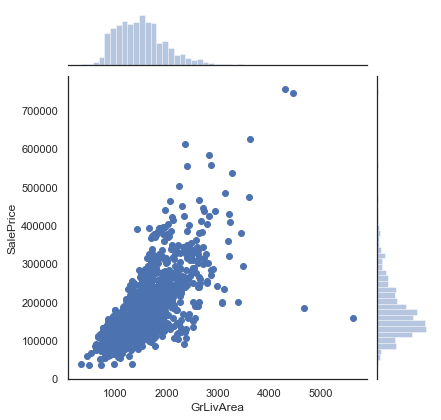
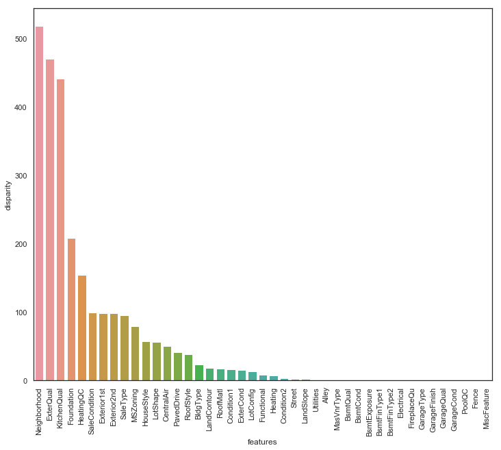
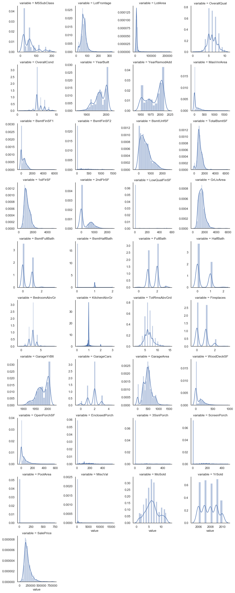
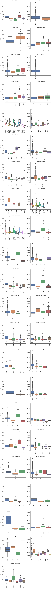

# Predicting House Prices of Ames, Iowa

The goal of this project is to predict house prices based a number of features (79 to be exact) of the town of Ames, Iowa. I will follow the steps outlined by FlatIron DataScience Bootcamp.

# Step 1: Understanding the Problem

This dataset has been provided by Kaggle. As with most house price datasets, the goal is to predict house prices based on a number of features. During this step, domain knowledge is critical. It is hard to know what you are analyzing if you are not sure about the subject matter. The phrase, "You don't know what you don't know" has never been more appropriate.

Here is a description of each feature:

    SalePrice - the property's sale price in dollars. This is the target variable that you're trying to predict.
    MSSubClass: The building class
    MSZoning: The general zoning classification
    LotFrontage: Linear feet of street connected to property
    LotArea: Lot size in square feet
    Street: Type of road access
    Alley: Type of alley access
    LotShape: General shape of property
    LandContour: Flatness of the property
    Utilities: Type of utilities available
    LotConfig: Lot configuration
    LandSlope: Slope of property
    Neighborhood: Physical locations within Ames city limits
    Condition1: Proximity to main road or railroad
    Condition2: Proximity to main road or railroad (if a second is present)
    BldgType: Type of dwelling
    HouseStyle: Style of dwelling
    OverallQual: Overall material and finish quality
    OverallCond: Overall condition rating
    YearBuilt: Original construction date
    YearRemodAdd: Remodel date
    RoofStyle: Type of roof
    RoofMatl: Roof material
    Exterior1st: Exterior covering on house
    Exterior2nd: Exterior covering on house (if more than one material)
    MasVnrType: Masonry veneer type
    MasVnrArea: Masonry veneer area in square feet
    ExterQual: Exterior material quality
    ExterCond: Present condition of the material on the exterior
    Foundation: Type of foundation
    BsmtQual: Height of the basement
    BsmtCond: General condition of the basement
    BsmtExposure: Walkout or garden level basement walls
    BsmtFinType1: Quality of basement finished area
    BsmtFinSF1: Type 1 finished square feet
    BsmtFinType2: Quality of second finished area (if present)
    BsmtFinSF2: Type 2 finished square feet
    BsmtUnfSF: Unfinished square feet of basement area
    TotalBsmtSF: Total square feet of basement area
    Heating: Type of heating
    HeatingQC: Heating quality and condition
    CentralAir: Central air conditioning
    Electrical: Electrical system
    1stFlrSF: First Floor square feet
    2ndFlrSF: Second floor square feet
    LowQualFinSF: Low quality finished square feet (all floors)
    GrLivArea: Above grade (ground) living area square feet
    BsmtFullBath: Basement full bathrooms
    BsmtHalfBath: Basement half bathrooms
    FullBath: Full bathrooms above grade
    HalfBath: Half baths above grade
    Bedroom: Number of bedrooms above basement level
    Kitchen: Number of kitchens
    KitchenQual: Kitchen quality
    TotRmsAbvGrd: Total rooms above grade (does not include bathrooms)
    Functional: Home functionality rating
    Fireplaces: Number of fireplaces
    FireplaceQu: Fireplace quality
    GarageType: Garage location
    GarageYrBlt: Year garage was built
    GarageFinish: Interior finish of the garage
    GarageCars: Size of garage in car capacity
    GarageArea: Size of garage in square feet
    GarageQual: Garage quality
    GarageCond: Garage condition
    PavedDrive: Paved driveway
    WoodDeckSF: Wood deck area in square feet
    OpenPorchSF: Open porch area in square feet
    EnclosedPorch: Enclosed porch area in square feet
    3SsnPorch: Three season porch area in square feet
    ScreenPorch: Screen porch area in square feet
    PoolArea: Pool area in square feet
    PoolQC: Pool quality
    Fence: Fence quality
    MiscFeature: Miscellaneous feature not covered in other categories
    MiscVal: $Value of miscellaneous feature
    MoSold: Month Sold
    YrSold: Year Sold
    SaleType: Type of sale
    SaleCondition: Condition of sale


# Step 2: Get Data


```python
# libraries 
import numpy as np 
import pandas as pd
import matplotlib.pyplot as plt
%matplotlib inline
import seaborn as sns
plt.rcParams['figure.figsize'] = (12.0, 10.0)
```


```python
# loading data
df = pd.read_csv('houseprice_ames_iowa.csv.csv')
```

# Step 3: Explore Data

After loading the data, it's great practice to view the structure, shape, values, and general info of the dataset.


```python
df.head()
```


<div>
<style scoped>
    .dataframe tbody tr th:only-of-type {
        vertical-align: middle;
    }

    .dataframe tbody tr th {
        vertical-align: top;
    }

    .dataframe thead th {
        text-align: right;
    }
</style>
<table border="1" class="dataframe">
  <thead>
    <tr style="text-align: right;">
      <th></th>
      <th>Id</th>
      <th>MSSubClass</th>
      <th>MSZoning</th>
      <th>LotFrontage</th>
      <th>LotArea</th>
      <th>Street</th>
      <th>Alley</th>
      <th>LotShape</th>
      <th>LandContour</th>
      <th>Utilities</th>
      <th>...</th>
      <th>PoolArea</th>
      <th>PoolQC</th>
      <th>Fence</th>
      <th>MiscFeature</th>
      <th>MiscVal</th>
      <th>MoSold</th>
      <th>YrSold</th>
      <th>SaleType</th>
      <th>SaleCondition</th>
      <th>SalePrice</th>
    </tr>
  </thead>
  <tbody>
    <tr>
      <th>0</th>
      <td>1</td>
      <td>60</td>
      <td>RL</td>
      <td>65.0</td>
      <td>8450</td>
      <td>Pave</td>
      <td>NaN</td>
      <td>Reg</td>
      <td>Lvl</td>
      <td>AllPub</td>
      <td>...</td>
      <td>0</td>
      <td>NaN</td>
      <td>NaN</td>
      <td>NaN</td>
      <td>0</td>
      <td>2</td>
      <td>2008</td>
      <td>WD</td>
      <td>Normal</td>
      <td>208500</td>
    </tr>
    <tr>
      <th>1</th>
      <td>2</td>
      <td>20</td>
      <td>RL</td>
      <td>80.0</td>
      <td>9600</td>
      <td>Pave</td>
      <td>NaN</td>
      <td>Reg</td>
      <td>Lvl</td>
      <td>AllPub</td>
      <td>...</td>
      <td>0</td>
      <td>NaN</td>
      <td>NaN</td>
      <td>NaN</td>
      <td>0</td>
      <td>5</td>
      <td>2007</td>
      <td>WD</td>
      <td>Normal</td>
      <td>181500</td>
    </tr>
    <tr>
      <th>2</th>
      <td>3</td>
      <td>60</td>
      <td>RL</td>
      <td>68.0</td>
      <td>11250</td>
      <td>Pave</td>
      <td>NaN</td>
      <td>IR1</td>
      <td>Lvl</td>
      <td>AllPub</td>
      <td>...</td>
      <td>0</td>
      <td>NaN</td>
      <td>NaN</td>
      <td>NaN</td>
      <td>0</td>
      <td>9</td>
      <td>2008</td>
      <td>WD</td>
      <td>Normal</td>
      <td>223500</td>
    </tr>
    <tr>
      <th>3</th>
      <td>4</td>
      <td>70</td>
      <td>RL</td>
      <td>60.0</td>
      <td>9550</td>
      <td>Pave</td>
      <td>NaN</td>
      <td>IR1</td>
      <td>Lvl</td>
      <td>AllPub</td>
      <td>...</td>
      <td>0</td>
      <td>NaN</td>
      <td>NaN</td>
      <td>NaN</td>
      <td>0</td>
      <td>2</td>
      <td>2006</td>
      <td>WD</td>
      <td>Abnorml</td>
      <td>140000</td>
    </tr>
    <tr>
      <th>4</th>
      <td>5</td>
      <td>60</td>
      <td>RL</td>
      <td>84.0</td>
      <td>14260</td>
      <td>Pave</td>
      <td>NaN</td>
      <td>IR1</td>
      <td>Lvl</td>
      <td>AllPub</td>
      <td>...</td>
      <td>0</td>
      <td>NaN</td>
      <td>NaN</td>
      <td>NaN</td>
      <td>0</td>
      <td>12</td>
      <td>2008</td>
      <td>WD</td>
      <td>Normal</td>
      <td>250000</td>
    </tr>
  </tbody>
</table>
<p>5 rows × 81 columns</p>
</div>


```python
df.info()
```

    <class 'pandas.core.frame.DataFrame'>
    RangeIndex: 1460 entries, 0 to 1459
    Data columns (total 81 columns):
    Id               1460 non-null int64
    MSSubClass       1460 non-null int64
    MSZoning         1460 non-null object
    LotFrontage      1201 non-null float64
    LotArea          1460 non-null int64
    Street           1460 non-null object
    Alley            91 non-null object
    LotShape         1460 non-null object
    LandContour      1460 non-null object
    Utilities        1460 non-null object
    LotConfig        1460 non-null object
    LandSlope        1460 non-null object
    Neighborhood     1460 non-null object
    Condition1       1460 non-null object
    Condition2       1460 non-null object
    BldgType         1460 non-null object
    HouseStyle       1460 non-null object
    OverallQual      1460 non-null int64
    OverallCond      1460 non-null int64
    YearBuilt        1460 non-null int64
    YearRemodAdd     1460 non-null int64
    RoofStyle        1460 non-null object
    RoofMatl         1460 non-null object
    Exterior1st      1460 non-null object
    Exterior2nd      1460 non-null object
    MasVnrType       1452 non-null object
    MasVnrArea       1452 non-null float64
    ExterQual        1460 non-null object
    ExterCond        1460 non-null object
    Foundation       1460 non-null object
    BsmtQual         1423 non-null object
    BsmtCond         1423 non-null object
    BsmtExposure     1422 non-null object
    BsmtFinType1     1423 non-null object
    BsmtFinSF1       1460 non-null int64
    BsmtFinType2     1422 non-null object
    BsmtFinSF2       1460 non-null int64
    BsmtUnfSF        1460 non-null int64
    TotalBsmtSF      1460 non-null int64
    Heating          1460 non-null object
    HeatingQC        1460 non-null object
    CentralAir       1460 non-null object
    Electrical       1459 non-null object
    1stFlrSF         1460 non-null int64
    2ndFlrSF         1460 non-null int64
    LowQualFinSF     1460 non-null int64
    GrLivArea        1460 non-null int64
    BsmtFullBath     1460 non-null int64
    BsmtHalfBath     1460 non-null int64
    FullBath         1460 non-null int64
    HalfBath         1460 non-null int64
    BedroomAbvGr     1460 non-null int64
    KitchenAbvGr     1460 non-null int64
    KitchenQual      1460 non-null object
    TotRmsAbvGrd     1460 non-null int64
    Functional       1460 non-null object
    Fireplaces       1460 non-null int64
    FireplaceQu      770 non-null object
    GarageType       1379 non-null object
    GarageYrBlt      1379 non-null float64
    GarageFinish     1379 non-null object
    GarageCars       1460 non-null int64
    GarageArea       1460 non-null int64
    GarageQual       1379 non-null object
    GarageCond       1379 non-null object
    PavedDrive       1460 non-null object
    WoodDeckSF       1460 non-null int64
    OpenPorchSF      1460 non-null int64
    EnclosedPorch    1460 non-null int64
    3SsnPorch        1460 non-null int64
    ScreenPorch      1460 non-null int64
    PoolArea         1460 non-null int64
    PoolQC           7 non-null object
    Fence            281 non-null object
    MiscFeature      54 non-null object
    MiscVal          1460 non-null int64
    MoSold           1460 non-null int64
    YrSold           1460 non-null int64
    SaleType         1460 non-null object
    SaleCondition    1460 non-null object
    SalePrice        1460 non-null int64
    dtypes: float64(3), int64(35), object(43)
    memory usage: 924.0+ KB
    


```python
df.describe()
```


<div>
<style scoped>
    .dataframe tbody tr th:only-of-type {
        vertical-align: middle;
    }

    .dataframe tbody tr th {
        vertical-align: top;
    }

    .dataframe thead th {
        text-align: right;
    }
</style>
<table border="1" class="dataframe">
  <thead>
    <tr style="text-align: right;">
      <th></th>
      <th>Id</th>
      <th>MSSubClass</th>
      <th>LotFrontage</th>
      <th>LotArea</th>
      <th>OverallQual</th>
      <th>OverallCond</th>
      <th>YearBuilt</th>
      <th>YearRemodAdd</th>
      <th>MasVnrArea</th>
      <th>BsmtFinSF1</th>
      <th>...</th>
      <th>WoodDeckSF</th>
      <th>OpenPorchSF</th>
      <th>EnclosedPorch</th>
      <th>3SsnPorch</th>
      <th>ScreenPorch</th>
      <th>PoolArea</th>
      <th>MiscVal</th>
      <th>MoSold</th>
      <th>YrSold</th>
      <th>SalePrice</th>
    </tr>
  </thead>
  <tbody>
    <tr>
      <th>count</th>
      <td>1460.000000</td>
      <td>1460.000000</td>
      <td>1201.000000</td>
      <td>1460.000000</td>
      <td>1460.000000</td>
      <td>1460.000000</td>
      <td>1460.000000</td>
      <td>1460.000000</td>
      <td>1452.000000</td>
      <td>1460.000000</td>
      <td>...</td>
      <td>1460.000000</td>
      <td>1460.000000</td>
      <td>1460.000000</td>
      <td>1460.000000</td>
      <td>1460.000000</td>
      <td>1460.000000</td>
      <td>1460.000000</td>
      <td>1460.000000</td>
      <td>1460.000000</td>
      <td>1460.000000</td>
    </tr>
    <tr>
      <th>mean</th>
      <td>730.500000</td>
      <td>56.897260</td>
      <td>70.049958</td>
      <td>10516.828082</td>
      <td>6.099315</td>
      <td>5.575342</td>
      <td>1971.267808</td>
      <td>1984.865753</td>
      <td>103.685262</td>
      <td>443.639726</td>
      <td>...</td>
      <td>94.244521</td>
      <td>46.660274</td>
      <td>21.954110</td>
      <td>3.409589</td>
      <td>15.060959</td>
      <td>2.758904</td>
      <td>43.489041</td>
      <td>6.321918</td>
      <td>2007.815753</td>
      <td>180921.195890</td>
    </tr>
    <tr>
      <th>std</th>
      <td>421.610009</td>
      <td>42.300571</td>
      <td>24.284752</td>
      <td>9981.264932</td>
      <td>1.382997</td>
      <td>1.112799</td>
      <td>30.202904</td>
      <td>20.645407</td>
      <td>181.066207</td>
      <td>456.098091</td>
      <td>...</td>
      <td>125.338794</td>
      <td>66.256028</td>
      <td>61.119149</td>
      <td>29.317331</td>
      <td>55.757415</td>
      <td>40.177307</td>
      <td>496.123024</td>
      <td>2.703626</td>
      <td>1.328095</td>
      <td>79442.502883</td>
    </tr>
    <tr>
      <th>min</th>
      <td>1.000000</td>
      <td>20.000000</td>
      <td>21.000000</td>
      <td>1300.000000</td>
      <td>1.000000</td>
      <td>1.000000</td>
      <td>1872.000000</td>
      <td>1950.000000</td>
      <td>0.000000</td>
      <td>0.000000</td>
      <td>...</td>
      <td>0.000000</td>
      <td>0.000000</td>
      <td>0.000000</td>
      <td>0.000000</td>
      <td>0.000000</td>
      <td>0.000000</td>
      <td>0.000000</td>
      <td>1.000000</td>
      <td>2006.000000</td>
      <td>34900.000000</td>
    </tr>
    <tr>
      <th>25%</th>
      <td>365.750000</td>
      <td>20.000000</td>
      <td>59.000000</td>
      <td>7553.500000</td>
      <td>5.000000</td>
      <td>5.000000</td>
      <td>1954.000000</td>
      <td>1967.000000</td>
      <td>0.000000</td>
      <td>0.000000</td>
      <td>...</td>
      <td>0.000000</td>
      <td>0.000000</td>
      <td>0.000000</td>
      <td>0.000000</td>
      <td>0.000000</td>
      <td>0.000000</td>
      <td>0.000000</td>
      <td>5.000000</td>
      <td>2007.000000</td>
      <td>129975.000000</td>
    </tr>
    <tr>
      <th>50%</th>
      <td>730.500000</td>
      <td>50.000000</td>
      <td>69.000000</td>
      <td>9478.500000</td>
      <td>6.000000</td>
      <td>5.000000</td>
      <td>1973.000000</td>
      <td>1994.000000</td>
      <td>0.000000</td>
      <td>383.500000</td>
      <td>...</td>
      <td>0.000000</td>
      <td>25.000000</td>
      <td>0.000000</td>
      <td>0.000000</td>
      <td>0.000000</td>
      <td>0.000000</td>
      <td>0.000000</td>
      <td>6.000000</td>
      <td>2008.000000</td>
      <td>163000.000000</td>
    </tr>
    <tr>
      <th>75%</th>
      <td>1095.250000</td>
      <td>70.000000</td>
      <td>80.000000</td>
      <td>11601.500000</td>
      <td>7.000000</td>
      <td>6.000000</td>
      <td>2000.000000</td>
      <td>2004.000000</td>
      <td>166.000000</td>
      <td>712.250000</td>
      <td>...</td>
      <td>168.000000</td>
      <td>68.000000</td>
      <td>0.000000</td>
      <td>0.000000</td>
      <td>0.000000</td>
      <td>0.000000</td>
      <td>0.000000</td>
      <td>8.000000</td>
      <td>2009.000000</td>
      <td>214000.000000</td>
    </tr>
    <tr>
      <th>max</th>
      <td>1460.000000</td>
      <td>190.000000</td>
      <td>313.000000</td>
      <td>215245.000000</td>
      <td>10.000000</td>
      <td>9.000000</td>
      <td>2010.000000</td>
      <td>2010.000000</td>
      <td>1600.000000</td>
      <td>5644.000000</td>
      <td>...</td>
      <td>857.000000</td>
      <td>547.000000</td>
      <td>552.000000</td>
      <td>508.000000</td>
      <td>480.000000</td>
      <td>738.000000</td>
      <td>15500.000000</td>
      <td>12.000000</td>
      <td>2010.000000</td>
      <td>755000.000000</td>
    </tr>
  </tbody>
</table>
<p>8 rows × 38 columns</p>
</div>


- The shape of dataset is: 1460 rows by 81 columns (features)
- There are 43 objects (strings), 35 int, and 3 floats datatypes columns 

There are missing values. Let's get a better understanding of how many.


```python
df.columns[df.isnull().any()]
```


    Index(['LotFrontage', 'Alley', 'MasVnrType', 'MasVnrArea', 'BsmtQual',
           'BsmtCond', 'BsmtExposure', 'BsmtFinType1', 'BsmtFinType2',
           'Electrical', 'FireplaceQu', 'GarageType', 'GarageYrBlt',
           'GarageFinish', 'GarageQual', 'GarageCond', 'PoolQC', 'Fence',
           'MiscFeature'],
          dtype='object')


```python
missing = None
missing = df.isnull().sum()/len(df)
missing = missing[missing > 0]
missing.sort_values(inplace=True)
missing
```


    Electrical      0.000685
    MasVnrType      0.005479
    MasVnrArea      0.005479
    BsmtQual        0.025342
    BsmtCond        0.025342
    BsmtFinType1    0.025342
    BsmtExposure    0.026027
    BsmtFinType2    0.026027
    GarageCond      0.055479
    GarageQual      0.055479
    GarageFinish    0.055479
    GarageType      0.055479
    GarageYrBlt     0.055479
    LotFrontage     0.177397
    FireplaceQu     0.472603
    Fence           0.807534
    Alley           0.937671
    MiscFeature     0.963014
    PoolQC          0.995205
    dtype: float64


There are 19 features with missing values. `PoolQC`, `MiscFeature`, and `Alley` all have over 90% missing values. Let's get a better sense of these features compared with the rest.


```python
missing = missing.to_frame()
missing.columns = ['count']
missing.index.names = ['Name']
missing['Name'] = missing.index

sns.set(style="whitegrid", color_codes=True)
sns.barplot(x = 'Name', y = 'count', data=missing)
plt.xticks(rotation = 90);
#sns.plt.show()
```





Dealing with missing values is a bit tricky. This is where domain knowledge comes into play. Should they be removed, changed to `0`, converted to mean, etc. Let's leave missing values alone for right now. 

Let's direct our attention to our target variable (price).


```python
sns.distplot(df['SalePrice']);
```

    C:\Users\Masood\Anaconda3\lib\site-packages\scipy\stats\stats.py:1713: FutureWarning: Using a non-tuple sequence for multidimensional indexing is deprecated; use `arr[tuple(seq)]` instead of `arr[seq]`. In the future this will be interpreted as an array index, `arr[np.array(seq)]`, which will result either in an error or a different result.
      return np.add.reduce(sorted[indexer] * weights, axis=axis) / sumval
    





```python
#skewness
print(df['SalePrice'].skew())
```

    1.8828757597682129
    

Our target variable has a right-skewed distribution. Before we train our model, the data needs to be normally distributed as it helps the model understand the relationship between our target (`SalePrice`) and the independent variables (features).

We'll need to log transform this variable so that it becomes normally distributed.


```python
target = np.log(df['SalePrice'])
sns.distplot(target)

print(target.skew())
```

    0.12133506220520406
    





Our target variable now has a normal distribuion and a skewness of 0.121.

Now let's plot a correlation matrix to understand which of the 80 features correlate with `SalePrice`. As a general approach, features which highly correlate with the target variable will be used in our machine learning model. Let's separate categorical variables and numerical variables to explore the data.


```python
# spliting the data. Recall, we have 38 numerical datatypes (int and float) and 43 categorical (objects)
numeric_data = df.select_dtypes(include=[np.number])
cat_data = df.select_dtypes(exclude=[np.number])

# removeing the Id column
del numeric_data['Id']
```


```python
# used code from: https://seaborn.pydata.org/examples/many_pairwise_correlations.html

# Set the style of the visualization
sns.set(style="white")

# Create a covariance matrix
corr = numeric_data.corr()

# Generate a mask the size of our covariance matrix
mask = np.zeros_like(corr, dtype=np.bool)
mask[np.triu_indices_from(mask)] = True

# Set up the matplotlib figure
f, ax = plt.subplots(figsize=(16, 16))
plt.title('Correlation Matrix',fontsize=25)

# Generate a custom diverging colormap
cmap = sns.diverging_palette(220, 10, as_cmap=True)

# Draw the heatmap with the mask and correct aspect ratio
sns.heatmap(corr, mask=mask, cmap=cmap, annot=False, vmax=1.0, center=0, square=True, linewidths=.25, cbar_kws={"shrink": .5})
```


    <matplotlib.axes._subplots.AxesSubplot at 0x19180ed9d68>





```python
print(corr['SalePrice'].sort_values(ascending=False)[:15], '\n') # top 15 
print(corr['SalePrice'].sort_values(ascending=False)[-5:]) # last 5
```

    SalePrice       1.000000
    OverallQual     0.790982
    GrLivArea       0.708624
    GarageCars      0.640409
    GarageArea      0.623431
    TotalBsmtSF     0.613581
    1stFlrSF        0.605852
    FullBath        0.560664
    TotRmsAbvGrd    0.533723
    YearBuilt       0.522897
    YearRemodAdd    0.507101
    GarageYrBlt     0.486362
    MasVnrArea      0.477493
    Fireplaces      0.466929
    BsmtFinSF1      0.386420
    Name: SalePrice, dtype: float64 
    
    YrSold          -0.028923
    OverallCond     -0.077856
    MSSubClass      -0.084284
    EnclosedPorch   -0.128578
    KitchenAbvGr    -0.135907
    Name: SalePrice, dtype: float64
    

`OverallQual` is 79% correlated with the `SalePrice`. The next top three, `GrLivArea`, `GarageCars`, `GarageArea` have 70%, 64%, and 62% correlation respectively. This tells us that the overall quality of material used to build the house and whether it has a garage is a strong indicator of the price a house. Let's examine `OverallQual` a bit more.


```python
df['OverallQual'].unique()
```


    array([ 7,  6,  8,  5,  9,  4, 10,  3,  1,  2], dtype=int64)


As we can see, `OverallQual` is a scale measurement of 1-10. Let's compare `OverallQual` with respect to medium house price. Because the `SalePrice` is skewed, selecting medium house price will help to alleviate any outliers which are present in our dataset.


```python
pivot = df.pivot_table(index='OverallQual', values='SalePrice', aggfunc=np.median)
pivot.plot(kind='bar');
```





Examining the graph, as `OverallQual` increases, so to does the `SalePrice` (I understand this seems obvious). This observation is not limited to just house prices. As an overall observation, generally speaking "higher quality equals higher price". Next, let's check `GrLivingArea`.


```python
sns.jointplot(x=df['GrLivArea'], y=df['SalePrice'])
```


    <seaborn.axisgrid.JointGrid at 0x191802c9438>





Clearly there is a linear relationship. Also worth noting, two outliers are present. Dealing with outliers is a bit different than dealing with missing values. Domain knowledge is important, however it doesn't take a PhD degree the two most left data points are outliers and will affect our model. Further examination of the outliers can be done, however for my analysis I will go ahead and remove them.

Let's examine categorical features now.


```python
cat_data.describe()
```


<div>
<style scoped>
    .dataframe tbody tr th:only-of-type {
        vertical-align: middle;
    }

    .dataframe tbody tr th {
        vertical-align: top;
    }

    .dataframe thead th {
        text-align: right;
    }
</style>
<table border="1" class="dataframe">
  <thead>
    <tr style="text-align: right;">
      <th></th>
      <th>MSZoning</th>
      <th>Street</th>
      <th>Alley</th>
      <th>LotShape</th>
      <th>LandContour</th>
      <th>Utilities</th>
      <th>LotConfig</th>
      <th>LandSlope</th>
      <th>Neighborhood</th>
      <th>Condition1</th>
      <th>...</th>
      <th>GarageType</th>
      <th>GarageFinish</th>
      <th>GarageQual</th>
      <th>GarageCond</th>
      <th>PavedDrive</th>
      <th>PoolQC</th>
      <th>Fence</th>
      <th>MiscFeature</th>
      <th>SaleType</th>
      <th>SaleCondition</th>
    </tr>
  </thead>
  <tbody>
    <tr>
      <th>count</th>
      <td>1460</td>
      <td>1460</td>
      <td>91</td>
      <td>1460</td>
      <td>1460</td>
      <td>1460</td>
      <td>1460</td>
      <td>1460</td>
      <td>1460</td>
      <td>1460</td>
      <td>...</td>
      <td>1379</td>
      <td>1379</td>
      <td>1379</td>
      <td>1379</td>
      <td>1460</td>
      <td>7</td>
      <td>281</td>
      <td>54</td>
      <td>1460</td>
      <td>1460</td>
    </tr>
    <tr>
      <th>unique</th>
      <td>5</td>
      <td>2</td>
      <td>2</td>
      <td>4</td>
      <td>4</td>
      <td>2</td>
      <td>5</td>
      <td>3</td>
      <td>25</td>
      <td>9</td>
      <td>...</td>
      <td>6</td>
      <td>3</td>
      <td>5</td>
      <td>5</td>
      <td>3</td>
      <td>3</td>
      <td>4</td>
      <td>4</td>
      <td>9</td>
      <td>6</td>
    </tr>
    <tr>
      <th>top</th>
      <td>RL</td>
      <td>Pave</td>
      <td>Grvl</td>
      <td>Reg</td>
      <td>Lvl</td>
      <td>AllPub</td>
      <td>Inside</td>
      <td>Gtl</td>
      <td>NAmes</td>
      <td>Norm</td>
      <td>...</td>
      <td>Attchd</td>
      <td>Unf</td>
      <td>TA</td>
      <td>TA</td>
      <td>Y</td>
      <td>Gd</td>
      <td>MnPrv</td>
      <td>Shed</td>
      <td>WD</td>
      <td>Normal</td>
    </tr>
    <tr>
      <th>freq</th>
      <td>1151</td>
      <td>1454</td>
      <td>50</td>
      <td>925</td>
      <td>1311</td>
      <td>1459</td>
      <td>1052</td>
      <td>1382</td>
      <td>225</td>
      <td>1260</td>
      <td>...</td>
      <td>870</td>
      <td>605</td>
      <td>1311</td>
      <td>1326</td>
      <td>1340</td>
      <td>3</td>
      <td>157</td>
      <td>49</td>
      <td>1267</td>
      <td>1198</td>
    </tr>
  </tbody>
</table>
<p>4 rows × 43 columns</p>
</div>


Because the data is categorical, to understand the correlation with `SalePrice`, we will use ANOVA test. ANOVA test is used to determine if there is a significant difference in the mean of the groups. If the test with respect to `SalePrice` is the same, the categorical feature can be removed.

Now, we'll define a function which calculates p values. From those p values, we'll calculate a disparity score. Higher the disparity score, better the feature in predicting sale price.

ANOVA requires a hypothesis:

- Ho - There exists no significant difference between the groups
- Ha - There exists a significant difference between the groups

First we need to calculate the p-values, and from there, the disparity score. Higher the disparity score, better the feature in predicting `SalePrice`.


```python
# function provided by FlatIron 
from scipy import stats
from scipy.stats import norm

cat = [f for f in df.columns if df.dtypes[f] == 'object']
def anova(frame):
    anv = pd.DataFrame()
    anv['features'] = cat
    pvals = []
    for c in cat:
           samples = []
           for cls in frame[c].unique():
                  s = frame[frame[c] == cls]['SalePrice'].values
                  samples.append(s)
           pval = stats.f_oneway(*samples)[1]
           pvals.append(pval)
    anv['pval'] = pvals
    return anv.sort_values('pval')

cat_data['SalePrice'] = df.SalePrice.values
k = anova(cat_data) 
k['disparity'] = np.log(1./k['pval'].values) 
sns.barplot(data=k, x = 'features', y='disparity') 
plt.xticks(rotation=90) 
plt 
```

    C:\Users\Masood\Anaconda3\lib\site-packages\ipykernel_launcher.py:20: SettingWithCopyWarning: 
    A value is trying to be set on a copy of a slice from a DataFrame.
    Try using .loc[row_indexer,col_indexer] = value instead
    
    See the caveats in the documentation: http://pandas.pydata.org/pandas-docs/stable/indexing.html#indexing-view-versus-copy
    C:\Users\Masood\Anaconda3\lib\site-packages\scipy\stats\stats.py:2923: RuntimeWarning: invalid value encountered in double_scalars
      ssbn += _square_of_sums(a - offset) / float(len(a))
    


    <module 'matplotlib.pyplot' from 'C:\\Users\\Masood\\Anaconda3\\lib\\site-packages\\matplotlib\\pyplot.py'>





The top three categorical features with respect to `SalePrice` are, `Neighborhood`, `ExterQual`, and `KitchenQual`. This indicates that the neighborhood and the quality of the exterior and kitchen are good indicators of the price of a house. There seems to be a trend in this dataset. People are interested in quality.

Now lets examine all the features.


```python
num = [f for f in df.columns if df.dtypes[f] != 'object']
num.remove('Id')
nd = pd.melt(df, value_vars = num)
n1 = sns.FacetGrid (nd, col='variable', col_wrap=4, sharex=False, sharey = False)
n1 = n1.map(sns.distplot, 'value')
n1
```


    <seaborn.axisgrid.FacetGrid at 0x19180a88c18>





With the expectation of `MoSold`, all the numerical features are skewed. The next steps would be to normalize them. Let's examine categorical features.


```python
def boxplot(x,y,**kwargs):
            sns.boxplot(x=x,y=y)
            x = plt.xticks(rotation=90)

cat = [f for f in df.columns if df.dtypes[f] == 'object']

p = pd.melt(df, id_vars='SalePrice', value_vars=cat)
g = sns.FacetGrid (p, col='variable', col_wrap=2, sharex=False, sharey=False, size=5)
g = g.map(boxplot, 'value','SalePrice')
g
```

    C:\Users\Masood\Anaconda3\lib\site-packages\seaborn\axisgrid.py:230: UserWarning: The `size` paramter has been renamed to `height`; please update your code.
      warnings.warn(msg, UserWarning)
    


    <seaborn.axisgrid.FacetGrid at 0x1918223c1d0>





Outliers everywhere! For practical purposes, I leave them alone and have the machine learning model deal with it (some machine learning algorithms can detect outliers).

# Step 4: Pre-processing 

In this step, we'll deal with NaN, remove outliers from `GrLivingArea`, and encode our features. Most machine learning models do not accept categorical values and must be converted to numerical using a process called LabelEncoder.


```python
# remove outlier from GrLivArea
df.drop(df[df['GrLivArea'] > 4000].index, inplace=True)
```


```python
# lotfrontage by median of neighborhood
lot_frontage_by_neighborhood = df['LotFrontage'].groupby(df['Neighborhood'])

for key, group in lot_frontage_by_neighborhood:
                idx = (df['Neighborhood'] == key) & (df['LotFrontage'].isnull())
                df.loc[idx, 'LotFrontage'] = group.median()
```


```python
# dealing with missing values
df.fillna(0, inplace=True)
```


```python
# a fucntion to convert categorical to numerical
from sklearn.preprocessing import LabelEncoder

le = LabelEncoder()
def factorize(data, var, fill_na = None):
      if fill_na is not None:
            data[var].fillna(fill_na, inplace=True)
      le.fit(data[var])
      data[var] = le.transform(data[var])
      return data
```

# Step 5: Feature Engineering

The purpose of feature engineering is to create new features which can help make predictions better. Many of the categorical variables have near-zero variance distribution (meaning one variable has over 90% of the values).


```python
# creating new variable based on count levels. highest count is kept as 1 and rest as 0
df["IsRegularLotShape"] = (df["LotShape"] == "Reg") * 1
df["IsLandLevel"] = (df["LandContour"] == "Lvl") * 1
df["IsLandSlopeGentle"] = (df["LandSlope"] == "Gtl") * 1
df["IsElectricalSBrkr"] = (df["Electrical"] == "SBrkr") * 1
df["IsGarageDetached"] = (df["GarageType"] == "Detchd") * 1
df["IsPavedDrive"] = (df["PavedDrive"] == "Y") * 1
df["HasShed"] = (df["MiscFeature"] == "Shed") * 1
df["Remodeled"] = (df["YearRemodAdd"] != df["YearBuilt"]) * 1

# modeling happen during the sale year
df["RecentRemodel"] = (df["YearRemodAdd"] == df["YrSold"]) * 1
```


```python
df.shape
```


    (1456, 90)


Now we'll remove the skewness of our features.


```python
#get numeric features
numeric_features = [f for f in df.columns if df[f].dtype != object]

#transform the numeric features using log
from scipy.stats import skew

skewed = df[numeric_features].apply(lambda x: skew(x.dropna().astype(float)))
skewed = skewed[skewed > 0.75]
skewed = skewed.index
df[skewed] = np.log1p(df[skewed])
df[skewed] = np.log1p(df[skewed])
```

Standardizing our features.


```python
from sklearn.preprocessing import StandardScaler
scaler = StandardScaler()
scaler.fit(df[numeric_features])
scaled = scaler.transform(df[numeric_features])

for i, col in enumerate(numeric_features):
       df[col] = scaled[:,i]

numeric_features.remove('SalePrice')
scaled = scaler.fit_transform(df[numeric_features])

for i, col in enumerate(numeric_features):
      df[col] = scaled[:,i]
```

One-hot encode the categorical variables.


```python
cat_names = cat_data.columns
cat_names
df_mod = df.copy()
```


```python
df_mod = pd.get_dummies(df_mod, columns=cat_names)
```


```python
df_mod.head()
```


<div>
<style scoped>
    .dataframe tbody tr th:only-of-type {
        vertical-align: middle;
    }

    .dataframe tbody tr th {
        vertical-align: top;
    }

    .dataframe thead th {
        text-align: right;
    }
</style>
<table border="1" class="dataframe">
  <thead>
    <tr style="text-align: right;">
      <th></th>
      <th>Id</th>
      <th>MSSubClass</th>
      <th>LotFrontage</th>
      <th>LotArea</th>
      <th>OverallQual</th>
      <th>OverallCond</th>
      <th>YearBuilt</th>
      <th>YearRemodAdd</th>
      <th>MasVnrArea</th>
      <th>BsmtFinSF1</th>
      <th>...</th>
      <th>SaleType_ConLw</th>
      <th>SaleType_New</th>
      <th>SaleType_Oth</th>
      <th>SaleType_WD</th>
      <th>SaleCondition_Abnorml</th>
      <th>SaleCondition_AdjLand</th>
      <th>SaleCondition_Alloca</th>
      <th>SaleCondition_Family</th>
      <th>SaleCondition_Normal</th>
      <th>SaleCondition_Partial</th>
    </tr>
  </thead>
  <tbody>
    <tr>
      <th>0</th>
      <td>-1.729139</td>
      <td>0.485775</td>
      <td>-0.042890</td>
      <td>-0.101126</td>
      <td>0.665646</td>
      <td>-0.517461</td>
      <td>1.053769</td>
      <td>0.880629</td>
      <td>1.229195</td>
      <td>0.625446</td>
      <td>...</td>
      <td>0</td>
      <td>0</td>
      <td>0</td>
      <td>1</td>
      <td>0</td>
      <td>0</td>
      <td>0</td>
      <td>0</td>
      <td>1</td>
      <td>0</td>
    </tr>
    <tr>
      <th>1</th>
      <td>-1.726767</td>
      <td>-1.157519</td>
      <td>0.562398</td>
      <td>0.144331</td>
      <td>-0.064709</td>
      <td>2.176545</td>
      <td>0.159469</td>
      <td>-0.427190</td>
      <td>-0.817960</td>
      <td>1.257846</td>
      <td>...</td>
      <td>0</td>
      <td>0</td>
      <td>0</td>
      <td>1</td>
      <td>0</td>
      <td>0</td>
      <td>0</td>
      <td>0</td>
      <td>1</td>
      <td>0</td>
    </tr>
    <tr>
      <th>2</th>
      <td>-1.724395</td>
      <td>0.485775</td>
      <td>0.090496</td>
      <td>0.445185</td>
      <td>0.665646</td>
      <td>-0.517461</td>
      <td>0.987524</td>
      <td>0.832191</td>
      <td>1.195093</td>
      <td>0.113946</td>
      <td>...</td>
      <td>0</td>
      <td>0</td>
      <td>0</td>
      <td>1</td>
      <td>0</td>
      <td>0</td>
      <td>0</td>
      <td>0</td>
      <td>1</td>
      <td>0</td>
    </tr>
    <tr>
      <th>3</th>
      <td>-1.722023</td>
      <td>0.691321</td>
      <td>-0.282120</td>
      <td>0.134346</td>
      <td>0.665646</td>
      <td>-0.517461</td>
      <td>-1.860986</td>
      <td>-0.717817</td>
      <td>-0.817960</td>
      <td>-0.513805</td>
      <td>...</td>
      <td>0</td>
      <td>0</td>
      <td>0</td>
      <td>1</td>
      <td>1</td>
      <td>0</td>
      <td>0</td>
      <td>0</td>
      <td>0</td>
      <td>0</td>
    </tr>
    <tr>
      <th>4</th>
      <td>-1.719651</td>
      <td>0.485775</td>
      <td>0.701521</td>
      <td>0.886417</td>
      <td>1.396000</td>
      <td>-0.517461</td>
      <td>0.954402</td>
      <td>0.735316</td>
      <td>1.327151</td>
      <td>0.506871</td>
      <td>...</td>
      <td>0</td>
      <td>0</td>
      <td>0</td>
      <td>1</td>
      <td>0</td>
      <td>0</td>
      <td>0</td>
      <td>0</td>
      <td>1</td>
      <td>0</td>
    </tr>
  </tbody>
</table>
<p>5 rows × 314 columns</p>
</div>


# Step 6: Model Training

Now we are ready to run a model. The goal is to build a model that can accurately predict `SalePrice` without overfitting. 


```python
import xgboost as xgb
from sklearn.pipeline import Pipeline
from sklearn.preprocessing import StandardScaler
from sklearn.decomposition import PCA
from sklearn.model_selection import GridSearchCV
from sklearn.model_selection import train_test_split
from sklearn.metrics import mean_squared_error, r2_score
from sklearn import svm
from sklearn.ensemble import RandomForestClassifier
from sklearn import tree
from sklearn.neighbors import NearestNeighbors
from sklearn.neighbors  import KNeighborsClassifier
from sklearn.linear_model import LogisticRegression
from sklearn.exceptions import DataConversionWarning
import warnings
warnings.filterwarnings(action='ignore', category=DataConversionWarning)
warnings.filterwarnings('ignore')
```


```python
X = df_mod.drop(['SalePrice', 'Id'], axis=1)
y = df_mod[['SalePrice']]

X_train, X_test, y_train, y_test = train_test_split(X, y)
#since we are using cross validation, we don't need to divide our data into training and test sets
```

## XGBoost


```python
# Create the pipeline for SVM
pipe_xgb = xgb.XGBRegressor()

#pipe_xgb = Pipeline([('scl', StandardScaler()),
                     #('clf', xgb.XGBRegressor(random_state=123))])

# Create the grid parameter
grid_xgb = [{'gamma': [0.0, 0.5, 1.0],
             'learning_rate': [0.05, 0.1, 1.0],
             'max_depth': [2, 5, 9],
             'n_estimators': [10, 20, 30]}]

# Create the grid, with "pipe" as the estimator
gridsearch_xgb = GridSearchCV(estimator=pipe_xgb,
                              param_grid=grid_xgb,
                              cv=3)

# Fit using grid search
gridsearch_xgb.fit(X_train, y_train)
best_parameters = gridsearch_xgb.best_params_
best_score = gridsearch_xgb.best_score_
print(best_parameters)
print(best_score)
```

    {'gamma': 0.0, 'learning_rate': 0.1, 'max_depth': 5, 'n_estimators': 30}
    0.8604332049072501
    

# Conclusion

The accuracy of our model using XGBoost is 86%. Different parameters with different value can be used further improve the accuracy. However, for my level of experience, I am content with this.
# houseprice_ames_iowa
